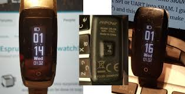

# Hypnos

This is a [Zephyr](https://www.zephyrproject.org/)-based firmware for the
[dsd6](https://github.com/fanoush/ds-d6) smartwatch.

it is based on (https://github.com/endian-albin/pinetime-hypnos)

There are a few differences between the pinetime and the dsd6 : most notably : the monochrome OLED display.
The dsd6 is less advanced from a hardware perspective, but it is cheap.
You might not find exactly the same watch, but this could be used as a basis for other watch projects.
As long as the specs are more or less the same : nordic nrf52832 microcontroller and ssd1306 display.

The only thing you would have to mod is the board definition file in zephyr.

This project makes use of toolkit (https://github.com/najnesnaj/dsd6-zephyr), which includes a pdf- epub- and html- manual.



> **Hypnos**, son of Night and Darkness</br>
> He is said to be a calm and gentle god, as he helps humans in need and, due to their sleep, owns
> half of their lives.<sup>[1](https://en.wikipedia.org/wiki/Hypnos)</sup>


## just testing

In directory firmware, you can find precompiled image.

## Features and roadmap

- [x] 100 % Free Software
- [x] Battery life: about one week
- [x] Battery status: get state of charge and whether it's charging
- [x] Clock: accurately increment current time
- [x] Time and date synchronization with Bluetooth-connected device
- [x] Touch sensor: tap to light up the display
- [x] LVGL graphics: show time, date, battery and Bluetooth status
- [x] Support for the mcuboot bootloader
- [x] Over-the-air firmware updates (SMP over BLE)
- [x] Optional debug output via JLink RTT
- [ ] Show notifications from Bluetooth-connected device
- [ ] Set alarm
- [ ] Wrist vibration
- [ ] Quick glance via lift-to-wake

## Getting started

### Set up the development environment

Follow Zephyr's [Getting Started Guide](https://docs.zephyrproject.org/latest/getting_started/index.html)
up to step 3.2 "Get the Zephyr source code". Here you should run the commands below
instead of the ones in the guide:
```
$ git clone https://github.com/najnesnaj/dsd6-hypnos
$ cd dsd6-hypnos
$ west init -l app/
$ west update
```

Then complete the remaining steps under section 3 and 4.

### Configure

Optionally enable RTT logging and/or disable bootloader support:
```
$ export BOOTLOADER="off"
$ export LOGGING="on"
```

### Build

Build the firmware for `dsd6` 
```
$ cd app/
$ west build -p -b <board> hypnos
```

### Install

Generate an mcuboot app image:
```
$ cd ../bootloader/mcuboot/scripts
$ pip3 install --user setuptools
$ pip3 install --user -r requirements.txt
$ ./imgtool.py create --align 4 --version 1.0.0 --header-size 512 --slot-size 475136 ../../../app/build/zephyr/zephyr.bin hypnos-mcuboot-app.bin
```
Connect your in-circuit programmer to the SWD pins on the watch.

Flash the image to offset 0x8000:
```
pyocd flash -e sector -a 0x8000 -t nrf52 hypnos-dfu-app.bin
```

If you have disabled bootloader support, flash the application directly using pyocd:
```
$ west flash
```
...or run `west flash --context` for more options.
